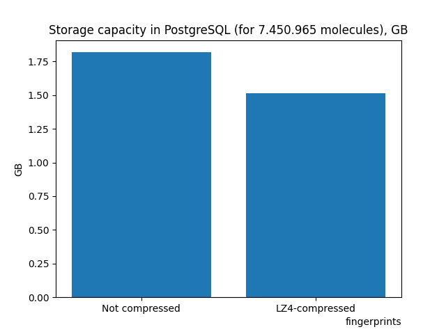
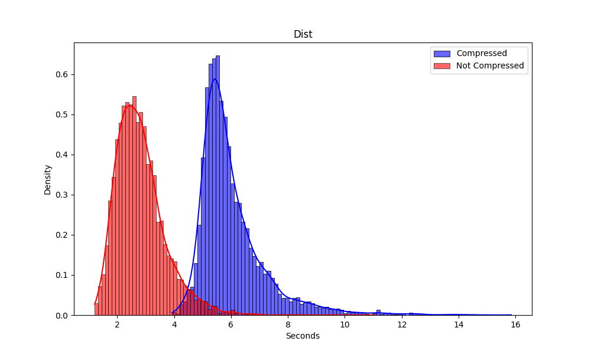

# benchmark
## 1. data for dataset of 7.450.965 molecules

There was 2 tables:

    1. morgan-fingerprint with popcounts (258 bytes each)
    2. morgan-fingerprint with popcounts, but compressed with lz4 (<258 bytes each)



## 3. data for query running 
following query was ran 5000 times for lz4-compressed and not compressed:
```sql
WITH mol_query AS (
    SELECT smiles_to_fingerprint(<SMILES>)::bytea AS query_bytes
)
SELECT id
FROM public.morgan, mol_query
WHERE is_tanimoto_similar(mol_query.query_bytes, morgan, 0.5);
```

There was first run for compressed data - 60 -120 seconds, for not compressed - 80 - 140 seconds. Other (probably with postgres cache) on the pic:

